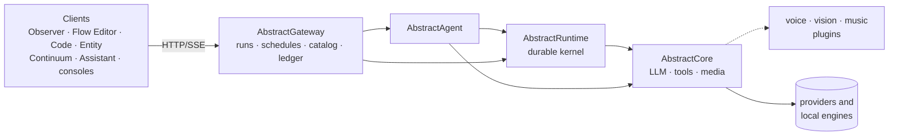

# AbstractFramework documentation

**Write once. Generate everything.**

A modular, open-source ecosystem for building **durable, observable, multimodal** AI systems. Text, voice, image, video, music — one unified interface, any provider, any model, local or cloud.

This doc set focuses on two things:

1. **How to pick the right entry point** (AbstractCore SDK vs AbstractGateway control plane)
2. **How the pieces compose** (clients → Gateway → Agent / Runtime → Core → providers)

Most implementation lives in component repositories. This repo ships the `abstractframework` meta-package (a pinned install profile) and the cross-package docs you're reading now.

---

## Start here

### Choose your entry point

Start lightweight with just the LLM library, or go all-in with a production gateway. Both paths lead to the same ecosystem.

### AbstractCore (SDK + optional `/v1`)

Start with **AbstractCore**:

- 9+ providers with identical API (local + cloud)
- Universal tool calling, structured output, streaming
- Media handling (images, PDFs, audio, video)
- OpenAI-compatible HTTP server mode (`/v1`)
- Multimodal via capability plugins (Voice, Vision, Music)

Read **[Getting Started](getting-started.md)** → "Core-first" section.

### AbstractGateway (durable control plane)

Start with **AbstractGateway** + **AbstractFlow**:

- Durable execution that survives crashes and restarts
- Append-only ledger (replay-first) for auditability
- Scheduled workflows (cron-style, recurring)
- Multi-client: terminal, browser, tray, Telegram, email
- Start on one device, continue on another

Read **[Getting Started](getting-started.md)** → "Gateway-first" section.

---

## How the pieces fit (one picture)

The full component diagram, with memory, semantics and the consoles, is in
[Architecture](architecture.md#component-view).

---

## Doc map

| Page | What it covers |
|---|---|
| **[Install](install.md)** | Mac installer, one-line install (`install.sh` / `install.ps1`), options, Network setting and uninstall; Light / Apple / GPU chooser, `abstractframework doctor`, installer manifest contract |
| **[Getting Started](getting-started.md)** | The two entry points + first end-to-end run |
| **[Agent sessions](agent-sessions.md)** | What every client shares when it chats with an agent: the gateway's default agent workflow, the conversation workspace and its built-in protection, skills, live replies, opening the Assistant signed in |
| **[Architecture](architecture.md)** | Component diagram, distribution by registry, how a turn flows and the live-reply lane, app proxies, model eject, framework identity, durable execution primitives, comparisons |
| **[Configuration](configuration.md)** | Minimal config, where defaults live, Core vs Gateway |
| **[Workspace scripts](workspace-scripts.md)** | Working from source: package inventory and tiers, `build.sh`, `status.sh`, `pull.sh`, `commit.sh`, `push.sh`, launchers |
| **[Glossary](glossary.md)** | Shared terminology (run, ledger, effect, wait, bundle, …) |
| **[ADR index](adr/README.md)** | Cross-package architectural decisions and accepted platform contracts |
| **[FAQ](faq.md)** | Common questions, comparisons, limits |
| **[Troubleshooting](troubleshooting.md)** | Symptoms, checks and fixes: installer blocked by macOS, sign-in links, ports, network access, providers |
| **[API](api.md)** | The `abstractframework` meta-package API (pins, helpers, re-exports, `doctor`, `manifest`) |
| **[Runtime artifacts and retrieval](guide/runtime-artifacts.md)** | Runtime, Gateway, Observer, ledger, and KG responsibility map for artifact/retrieval work |
| **[Shipped workflows](https://github.com/lpalbou/AbstractGateway/blob/main/docs/shipped-workflows.md)** | The workflows a packaged Gateway serves out of the box — coder, deep research, co-scientist — and how to run them |

---

## Package map by layer

The root [README](../README.md) is the fuller package catalog. This shorter map
keeps the docs hub cross-linked to the package owners' entrypoints.

### Foundation

| Package | What it is |
|---|---|
| [abstractcore](https://github.com/lpalbou/AbstractCore) | Unified LLM interface: providers, tools, structured output, media, embeddings, `/v1` server, capability plugins |
| [abstractsemantics](https://github.com/lpalbou/AbstractSemantics) | Shared semantics registry for predicates and entity types |
| [abstractmemory](https://github.com/lpalbou/AbstractMemory) | Durable, append-only agent memory: usage-weighted graph + journal — recall, formation, consolidation (the entity mind engine) |

### Durable execution

| Package | What it is |
|---|---|
| [abstractruntime](https://github.com/lpalbou/AbstractRuntime) | Durable execution kernel: runs, effects, waits, append-only ledger, artifacts, and the entity identity lane |
| [abstractagent](https://github.com/lpalbou/AbstractAgent) | ReAct, CodeAct, and MemAct patterns on top of Runtime + Core |
| [abstractflow](https://github.com/lpalbou/AbstractFlow) | Visual workflow editor and portable `.flow` bundles |

### Control plane

| Package | What it is |
|---|---|
| [abstractgateway](https://github.com/lpalbou/AbstractGateway) | Deployable control plane: durable runs over HTTP/SSE, scheduling, workflow catalog, auth, artifact/ledger serving, and the summoned-entity door |

### Multimodal capabilities

| Package | What it is |
|---|---|
| [abstractvoice](https://github.com/lpalbou/AbstractVoice) | Voice I/O (TTS / STT), local and remote backends |
| [abstractvision](https://github.com/lpalbou/AbstractVision) | Model-agnostic image generation |
| [abstractmusic](https://github.com/lpalbou/AbstractMusic) | Text-to-music / text-to-audio capability plugin |
| [abstract3d](https://github.com/lpalbou/abstract3d) | Local-first 3D generation |
| [abstractcamera](https://github.com/lpalbou/AbstractCamera) | Camera control and capture tools |

### Apps and clients

| Package | What it is |
|---|---|
| [abstractcode](https://github.com/lpalbou/AbstractCode) | Coding client with durable sessions and tool approvals: Rust terminal client (`cargo install abstractcode`) and browser client (`npx @abstractframework/code`) |
| [abstractassistant](https://github.com/lpalbou/AbstractAssistant) | macOS tray client for gateway-native chat and voice |
| [abstractobserver](https://github.com/lpalbou/AbstractObserver) | Browser UI for monitoring, control, and scheduling |
| [abstractentity](https://github.com/lpalbou/AbstractEntity) | Summoned-entity manager and chat/replay UI |
| [abstractcontinuum](https://github.com/lpalbou/AbstractContinuum) | Continuous iterative development and deployment console |
| Consoles | Web consoles built into `abstractgateway serve` and `abstractcore serve` (`/console`, with Models and Engines tabs); terminal consoles `cargo install abstractgateway-console` and `cargo install abstractcore-console` |

### Shared libraries

| Package | What it is |
|---|---|
| [abstracttui](https://github.com/lpalbou/AbstractTUI) | Reactive Rust terminal UI engine |
| [abstractuic](https://github.com/lpalbou/AbstractUIC) | Shared React/Web Components UI kit: chat panel with live replies, the About dialog, the app-server proxy |
| [abstractskill](https://github.com/lpalbou/AbstractSkill) | Shared Agent Skills (`SKILL.md`) loader, trust gate, and the curated skill shelf the gateway serves |

---

## Example apps

| App | What it does |
|---|---|
| **AbstractCode** | Terminal agentic dev client (local, durable sessions) |
| **AbstractAssistant** | macOS tray client (gateway-first, gateway default or picked workflow, live replies, voice); **Open** in the gateway console starts it signed in |
| **AbstractObserver** | Browser UI to monitor, control, and schedule gateway runs |
| **Code Web UI** | Browser coding assistant (gateway-backed): workflow selector, Files tab, live replies |

---

## More docs

| Folder | What's inside |
|---|---|
| [docs/guide/](guide/) | Focused "how it works" notes |
| [docs/scenarios/](scenarios/) | End-to-end walkthroughs by use case |
| [docs/installers/](installers/README.md) | Install design: script bootstrap + gateway console, per-OS journeys, OS security, manifest, operations |
| [docs/comparisons/](comparisons/) | Trade-offs vs other frameworks |
| [docs/adr/](adr/README.md) | Architecture decision records |
| [CHANGELOG.md](../CHANGELOG.md) | Release history of the meta-package and its pins |
| [CONTRIBUTING.md](../CONTRIBUTING.md) · [SECURITY.md](../SECURITY.md) | Contributing to this repository; reporting a vulnerability |
