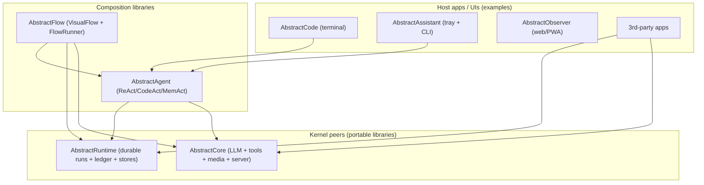
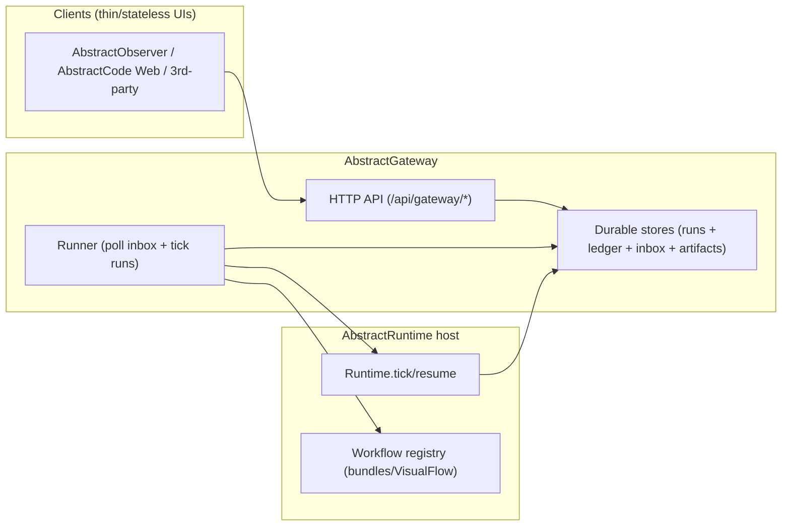

# Architecture

AbstractFramework is an ecosystem for building **durable, observable** agentic systems.
The core idea is simple:

- execution is a **persisted state machine** (runs survive restarts)
- blocking is explicit (**waits**) and resumable
- observability is append-only (**ledger**), so UIs can render by replaying history
- tools are executed at a durable boundary (schemas/specs are durable; callables live in the host)

This document describes the “how the pieces fit” view and points you to the projects that implement each part.

## Core concepts (glossary)

- **Workflow**: a graph of nodes that returns “what to do next”.
- **Run**: a durable instance of a workflow (identified by `run_id`).
- **Effect**: a typed request for side effects (LLM call, tool calls, ask user, wait until/event, memory ops, …).
- **Wait**: an explicit durable pause (`WAITING`) with a `wait_key` that must be resumed.
- **Ledger**: append-only step records for a run (replayable source of truth).
- **Artifacts**: offloaded large payloads (attachments, big tool outputs, archived spans) stored by reference.
- **Bundle (`.flow`)**: a portable workflow distribution unit (VisualFlow JSON + manifest).

## Layering (libraries)

Two peers form the foundation:

- **AbstractRuntime** (durable execution + ledger + stores)
- **AbstractCore** (LLM providers + tool calling + structured output + media handling)

Composition happens in:

- **AbstractAgent** (agent patterns like ReAct/CodeAct/MemAct)
- **AbstractFlow** (portable VisualFlow workflows + authoring/execution helpers)

**Important:** Runtime and Core are peers. Runtime can be used without Core (pure workflows); Core can be used without Runtime (simple LLM apps).
When you *combine* them, Runtime mediates LLM/tool effects using Core’s normalization and (optionally) Core’s server.

## Deployment shape (gateway-first)

When you want remote execution, multi-client UIs, or a control plane, you deploy **AbstractGateway**:

- starts runs from workflow sources (typically `.flow` bundles)
- accepts a **durable command inbox** (`pause`, `resume`, `cancel`, `emit_event`, …)
- exposes a **replay-first ledger** API (paged replay + optional SSE stream)
- enforces a security baseline (token + origin allowlist + limits)

Thin clients (like AbstractObserver) render by replaying/streaming the ledger and act by submitting durable commands.

## Durability contract (why the stack looks like this)

### 1) JSON-safe state

Durable checkpoint state must be JSON-serializable. Large values should be stored as artifacts and referenced.

This enables:
- persistence across restarts (no Python stacks/coroutines to keep alive)
- deterministic replay/debuggability (ledger + checkpoints)
- thin clients (UIs just replay history)

### 2) Tool boundary (specs vs execution)

Tool **schemas/specs** are durable; tool **callables** are not.

Typical flow:
1. an LLM produces tool call specs
2. the runtime emits a durable `TOOL_CALLS` wait (approval boundary)
3. a host (terminal app, gateway worker, operator, MCP worker) executes tools
4. the host resumes the run with JSON tool results

This is how AbstractCode and AbstractAssistant remain restart-safe, and how gateway-first systems stay auditable.

### 3) Replay-first observability

The ledger is the source of truth:
- clients page through history (`after` cursor)
- clients optionally open an SSE stream for new steps
- clients can reconnect at any time and recover by replaying

## Workflows: authoring and distribution

AbstractFlow defines a portable JSON format (**VisualFlow**) and helpers to execute it from any host.
For distribution, workflows are bundled as `.flow` files (manifest + VisualFlow JSON files).

The bundle format and compilation semantics are owned by AbstractRuntime; AbstractFlow provides authoring and convenience layers.

## Memory: active context vs durable history

AbstractRuntime separates:
- **durable history** (recoverable from stores + artifacts)
- **active context** (the compacted, LLM-visible message view)

Runtime-owned compaction archives spans to artifacts and inserts summaries with provenance handles so workflows/agents can recall and rehydrate deterministically.

For a semantic KG substrate, **AbstractMemory** provides temporal, provenance-aware triple assertions with deterministic query semantics.
For consistent predicate/entity type IDs and structured-output schemas, **AbstractSemantics** ships a central editable registry + JSON Schema helpers.

## Where to go deeper (per project)

- AbstractCore architecture: https://github.com/lpalbou/abstractcore/blob/main/docs/architecture.md
- AbstractRuntime architecture: https://github.com/lpalbou/abstractruntime/blob/main/docs/architecture.md
- AbstractAgent architecture: https://github.com/lpalbou/abstractagent/blob/main/docs/architecture.md
- AbstractFlow architecture: https://github.com/lpalbou/abstractflow/blob/main/docs/architecture.md
- AbstractGateway architecture: https://github.com/lpalbou/AbstractGateway/blob/main/docs/architecture.md
- AbstractObserver architecture: https://github.com/lpalbou/AbstractObserver/blob/main/docs/architecture.md
