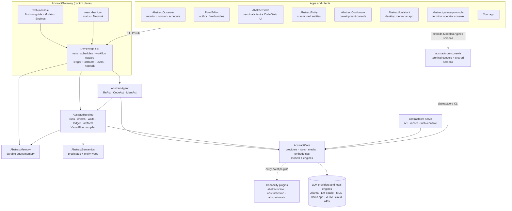
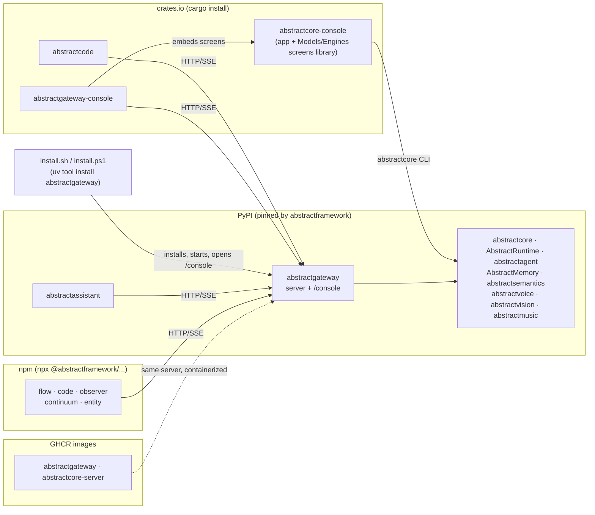
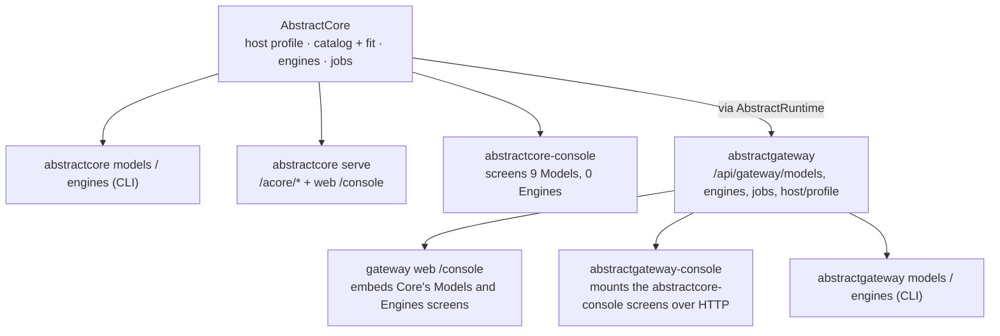

# Architecture

AbstractFramework is open-source AI infrastructure built around one idea: **durable, observable execution** for AI workflows.

Most LLM frameworks optimize for prototyping speed. AbstractFramework optimizes for **operational reality**: workflows that pause/resume safely, runs that survive restarts, UIs that reconstruct state from history, and clear boundaries around tool execution and approvals.

---

## Choose your entry point

Start lightweight with just the LLM library, or go all-in with a production gateway. Both paths lead to the same ecosystem.

### AbstractCore (SDK + optional `/v1`)

Start here if you need a lightweight LLM library for scripts, notebooks, or existing applications. No infrastructure required — just install and call. Add multimodal capabilities with plugins as you grow.

- 9+ providers with identical API (local + cloud)
- Universal tool calling, structured output, streaming
- Media handling (images, PDFs, audio, video)
- OpenAI-compatible HTTP server mode (`/v1`), with a web console at `/console`
- Local model and engine management: browse models that fit this machine, download, delete, install engines
- Multimodal via capability plugins (Voice, Vision, Music)

The right first step when you mainly care about calling models/tools/media (in-process via Python or via `/v1`) and want the smallest surface area.

### AbstractGateway (durable control plane)

Start here if you're building persistent AI applications — agents that run for hours, workflows that survive crashes, scheduled tasks. The gateway is your AI control plane: durable runs with ledger replay/streaming and thin clients that can attach/detach across devices.

- Durable execution that survives crashes and restarts
- Append-only ledger (replay-first) for auditability
- Scheduled workflows (cron-style, recurring)
- Multi-client: terminal, browser, tray, Telegram, email
- Start on one device, continue on another

The composition root when you need a control plane (local or remote).

---

## Component view

Every client talks to the gateway over HTTP/SSE. The gateway composes the Python packages below it
in one process: agent patterns, the durable runtime, memory and AbstractCore, which reaches the
model providers and local engines. Arrows point from a component to what it calls or depends on.

```mermaid
flowchart TB
    subgraph CLIENTS["Apps and clients"]
        OBS["AbstractObserver<br/>monitor · control · schedule"]
        FLOWED["Flow Editor<br/>author .flow bundles"]
        CODE["AbstractCode<br/>terminal client + Code Web UI"]
        ENT["AbstractEntity<br/>summoned entities"]
        CONT["AbstractContinuum<br/>development console"]
        ASSIST["AbstractAssistant<br/>desktop menu-bar app"]
        GCON["abstractgateway-console<br/>terminal operator console"]
        APP["Your app"]
    end

    subgraph GATEWAY["AbstractGateway (control plane)"]
        API["HTTP/SSE API<br/>runs · schedules · workflow catalog<br/>ledger + artifacts · users · network"]
        WEB["web /console<br/>first-run guide · Models · Engines"]
        TRAY["menu-bar icon<br/>status · Network"]
    end

    AGENT["AbstractAgent<br/>ReAct · CodeAct · MemAct"]
    RT["AbstractRuntime<br/>runs · effects · waits · ledger · artifacts<br/>VisualFlow compiler"]
    MEM["AbstractMemory<br/>durable agent memory"]
    SEM["AbstractSemantics<br/>predicates + entity types"]
    CORE["AbstractCore<br/>providers · tools · media · embeddings<br/>models + engines"]
    PLUG["Capability plugins<br/>abstractvoice · abstractvision · abstractmusic"]
    CSRV["abstractcore serve<br/>/v1 · /acore · web /console"]
    CCON["abstractcore-console<br/>terminal console + shared screens"]
    PROV[("LLM providers and local engines<br/>Ollama · LM Studio · MLX · llama.cpp · vLLM · cloud APIs")]

    CLIENTS -->|HTTP/SSE| API
    WEB --> API
    TRAY --> API
    GCON -->|embeds Models/Engines screens| CCON
    API --> AGENT
    API --> RT
    API --> MEM
    AGENT --> RT
    AGENT --> CORE
    RT --> CORE
    RT --> MEM
    RT --> SEM
    CORE -.->|entry-point plugins| PLUG
    CORE --> PROV
    CSRV --> CORE
    CCON -->|abstractcore CLI| CORE
```

The layers, from the top:

- **Apps and clients** are thin: they hold no durable state and rebuild their view by replaying
  the ledger, then follow new events over SSE. The Flow Editor publishes `.flow` bundles to the
  gateway; the others start, observe and steer runs.
- **AbstractGateway** owns the run lifecycle (start, resume, cancel), durable schedules, private
  bundle discovery and the shared workflow catalog, users and auth, the Network setting, and
  ledger/artifact serving. Its web console and menu-bar icon are part of the same package.
- **AbstractAgent** provides ready-made agent loops; **AbstractRuntime** is the durable kernel that
  executes them and compiles VisualFlow graphs from `.flow` bundles into workflows.
- **AbstractCore** is the LLM layer: provider and model abstraction, capability routing defaults,
  tools, structured output, media, embeddings, MCP, and the local model and engine management
  (catalog with a fit verdict, downloads, engine installs). Voice, image and music arrive as
  capability plugins.
- **AbstractCore on its own** (`abstractcore serve`) is the second entry point: an
  OpenAI-compatible `/v1` server with its own console, without the durable layers.

## How the framework is distributed

Each layer ships through the registry that fits it. The `abstractframework` meta-package pins the
Python side with exact versions; the apps and terminal tools are installed next to it.

```mermaid
flowchart LR
    subgraph PyPI["PyPI (pinned by abstractframework)"]
        GW["abstractgateway<br/>server + /console"]
        AS["abstractassistant"]
        STACK["abstractcore · AbstractRuntime · abstractagent<br/>AbstractMemory · abstractsemantics<br/>abstractvoice · abstractvision · abstractmusic"]
    end
    subgraph npm["npm (npx @abstractframework/...)"]
        APPS["flow · code · observer<br/>continuum · entity"]
    end
    subgraph crates["crates.io (cargo install)"]
        CLI["abstractcode"]
        CON["abstractgateway-console"]
        CCON["abstractcore-console<br/>(app + Models/Engines screens library)"]
    end
    subgraph GHCR["GHCR images"]
        IMG["abstractgateway · abstractcore-server"]
    end
    BOOT["install.sh / install.ps1<br/>(uv tool install abstractgateway)"]
    BOOT -->|installs, starts, opens /console| GW
    AS -->|HTTP/SSE| GW
    APPS -->|HTTP/SSE| GW
    CLI -->|HTTP/SSE| GW
    CON -->|HTTP/SSE| GW
    CON -->|embeds screens| CCON
    CCON -->|abstractcore CLI| STACK
    GW --> STACK
    IMG -.->|same server, containerized| GW
```

The Models and Engines features are implemented once, in AbstractCore, and inherited by the
gateway:

```mermaid
flowchart TB
    CORE["AbstractCore<br/>host profile · catalog + fit · engines · jobs"]
    CORE --> CCLI["abstractcore models / engines (CLI)"]
    CORE --> CAPI["abstractcore serve<br/>/acore/* + web /console"]
    CORE --> CTUI["abstractcore-console<br/>screens 9 Models, 0 Engines"]
    CORE -->|via AbstractRuntime| GAPI["abstractgateway<br/>/api/gateway/models, engines, jobs, host/profile"]
    GAPI --> GWEB["gateway web /console<br/>embeds Core's Models and Engines screens"]
    GAPI --> GTUI["abstractgateway-console<br/>mounts the abstractcore-console screens over HTTP"]
    GAPI --> GCLI["abstractgateway models / engines (CLI)"]
```

Every console action shows its command-line equivalent. Download, delete and engine installs are
admin-only jobs; engine installs from a console are enabled by default only for a server bound to
loopback (`allow_engine_install` on the gateway, `ABSTRACTCORE_ALLOW_ENGINE_INSTALL` on the core
server).

See [Install AbstractFramework](install.md) for the versions released together and the commands
for each registry.

**AbstractFlow** is the authoring/distribution layer: you design a VisualFlow graph, export a `.flow` bundle, and run it anywhere a compatible host exists.

**AbstractAgent** is the composition layer: ready-made agent loops (ReAct, CodeAct, MemAct) built on top of Runtime. These can be used standalone or inside a Flow as agent nodes.

Portable workflow execution does not require every client to be a generic workflow picker. Some
products expose workflow selection, while others intentionally bind to one published workflow or
interface family for a specialized task. The invariant is that execution still happens as a durable
Gateway/Runtime workflow.

---

## Durable execution primitives

These are the "why" behind the design — the properties that make the framework operationally useful.

### Run

A durable workflow instance with persisted state. Identified by a `run_id`.

### Ledger

The append-only history of a run: every step, effect, result, wait, and error is recorded.

This is what makes replay-first UIs possible: a client reconstructs state by replaying history, then follows along by streaming new events over SSE.

For Core-backed multimodal generation, Runtime can also persist bounded `resolved_actions`
summaries in replay exports. Those records capture the normalized request/output summary and the
effective resolved route without turning route internals into the ordinary app-facing vocabulary.

### Effects and waits

Work happens at explicit boundaries:

- An **effect** is a request for a side-effect (LLM call, tool call, ask user, wait-until, …).
- A **wait** is a checkpointed pause until external input arrives (tool results, user answer, a timer).

The key property: if a process dies while waiting, **the run is still correct**. Another process (or a restart) can resume it from the recorded wait.

### Artifacts

Large payloads (files, media, big tool results) are stored as **artifacts** and referenced by handle from JSON state and the ledger. This keeps state JSON-safe without losing evidence.

### Tool execution boundary

Tool **schemas** are durable (stored in the ledger). Tool **callables** are not (they live in the host process). This is intentional:

- Tool calls become explicit approval points (configurable per tool)
- Execution is auditable (arguments + results in the ledger)
- Runs remain restart-safe (the tool call is a wait, not an in-process function call)

---

## Workflow lifecycle: author → deploy → run → observe

### 1) Author with AbstractFlow

Build a workflow graph in the Flow Editor and export it as a `.flow` bundle.

### 2) Deploy the bundle

Copy bundles to `ABSTRACTGATEWAY_FLOWS_DIR`. The gateway discovers them automatically.

For hosted or multi-user gateways, admins can also promote immutable bundle
versions into the Gateway workflow catalog. The catalog owns shared/default
workflow pointers and ACLs; each catalog run executes in the requesting user's
runtime.

### 3) Run from any client

Any gateway-backed client can: list bundles/entrypoints, start a run, attach to ledger replay/streaming, and resume waits (approvals, user input, tool results).

### 4) Observe and schedule with AbstractObserver

- Inspect any run (ledger replay)
- Watch a run live (SSE)
- Control runs (cancel, resume)
- Schedule recurring runs

## File-like sources in hosted clients

Hosted clients such as AbstractFlow need a clear split between file origin and
runtime value:

- `Artifact`: a saved Runtime-owned file payload. Reusable across runs.
- `Local File`: a file chosen from the client device. In hosted/browser mode it
  is uploaded and normalized into an Artifact before durable execution.
- `Server File`: a user-facing label for a file inside Gateway-approved
  workspace scope on the server. Path-based operations still depend on
  workspace policy and current grants; importing it creates an Artifact
  snapshot.

Internally, the durable payload handle is the artifact ref. Server-side path
access stays a Gateway-owned workspace capability rather than a generic server
filesystem abstraction. Some UI surfaces label server files `Workspace`; it
means the same Gateway-approved scope.

---

## Multimodality

AbstractCore stays lightweight by treating modalities as **capability plugins** (discovered internally via Python entry points, then exposed via the AbstractCore SDK and its optional `/v1` endpoints; gateway-first deployments can also surface them through Gateway):

| Plugin | Capability | API surface |
|---|---|---|
| `abstractvoice` | TTS + STT | `llm.voice.tts(...)`, `llm.audio.transcribe(...)` |
| `abstractvision` | Image generation | `llm.vision.t2i(...)` |
| `abstractmusic` | Music generation | `llm.music.t2m(...)` |

Install a plugin; the API appears on your `llm` instance. Don't install it; Core stays small.

---

## How it compares (honest positioning)

### vs direct provider SDKs (OpenAI, Anthropic)

Direct SDKs are the right choice when you only use one provider and don't need durable orchestration.

AbstractCore adds value when you need: provider portability, consistent tool/structured-output behavior across backends, media policies, modality plugins, or a stable configuration layer that doesn't leak into app code.

### vs LangChain / LlamaIndex / PydanticAI

Those are primarily **in-process orchestration libraries**. AbstractFramework occupies a different niche: an **agentic OS-style** stack for durable, observable execution (runtime + append-only ledger + control plane), where the same workflows can run across providers, devices, and deployment modes.

**Where AbstractFramework is stronger**: durability and pause/resume as primitives, replay-first observability, portable `.flow` bundles that run across clients.

**Where others are stronger**: large connector/RAG ecosystems, minimal boilerplate for simple use cases, broader community examples.

### vs Temporal / Step Functions / job schedulers

AbstractGateway is architecturally closer to these systems, but specialized for LLM/tool loops: tool approval waits, AI-oriented artifacts, and replay-first thin-client UIs over HTTP/SSE.

---

## Where to go deeper

- **[Getting Started](getting-started.md)** — run Core-first or Gateway-first
- **[Configuration](configuration.md)** — minimal config, where defaults live
- **[Glossary](glossary.md)** — shared definitions (run, ledger, effect, wait, bundle, interface contract)
- **[API](api.md)** — the meta-package helpers and the functional API owner of each concern
- **[Install](install.md)** — how each part reaches a machine, and the Network setting
- **[Installer design](installers/README.md)** — the bootstrap + console install model
- **[ADR index](adr/README.md)** — accepted cross-package decisions, including
  [package dependency boundaries](adr/0032-package-dependency-boundaries-and-gateway-first-apps.md),
  [install profiles](adr/0033-install-profiles-config-entrypoints-and-server-boundaries.md) and
  [the script bootstrap install](adr/0038-script-bootstrap-and-gateway-console-install.md)
- **[Runtime artifacts and retrieval](guide/runtime-artifacts.md)** — who owns artifacts, ledger and retrieval
- Per-project architecture docs live in the component repositories
