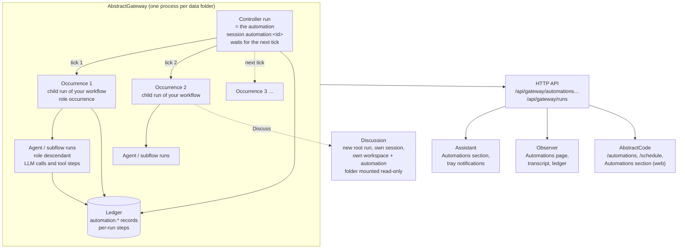

# Automations

How automations work in practice and how to manage them.

An **automation** runs a workflow again and again on a trigger: "search every 5 minutes for the trade
value of a market share", "monitor the memory usage of this computer every 2 minutes", "run this
report when I ask". The gateway runs it, keeps every run as a readable conversation, and tells you
only when something needs you. You create and manage automations from the Assistant, the
Observer or AbstractCode (terminal and browser), and you can read their results in every gateway
client.

This page is the cross-package guide. The package pages hold the full references:

| Topic | Reference |
|---|---|
| The automation object, triggers, commands, crash safety | [AbstractRuntime: Automations](https://github.com/lpalbou/AbstractRuntime/blob/main/docs/automations.md) |
| The HTTP API (`/api/gateway/automations…`, `/trigger-sources`), errors, run-list fields | [AbstractGateway: Automations API](https://github.com/lpalbou/AbstractGateway/blob/main/docs/automations.md) |
| The Automations section, "Schedule this conversation…", tray notifications | [AbstractAssistant: Sessions and automations](https://github.com/lpalbou/AbstractAssistant/blob/main/docs/automations.md) |
| Launch → Automate, the Automations page, legacy schedules | [AbstractObserver: Automations](https://github.com/lpalbou/AbstractObserver/blob/main/docs/automations.md) |
| `/automations` and `/schedule` in the terminal, the Automations section in the browser | [AbstractCode: Automations](https://github.com/lpalbou/AbstractCode/blob/main/docs/automations.md) |
| Automation defaults on a workflow | [AbstractFlow: Web editor → Automation Defaults](https://github.com/lpalbou/AbstractFlow/blob/main/docs/web-editor.md#automation-defaults) |
| `AutomationPanel`, `AfScheduleDialog`, the shared client | [AbstractUIC: Automations](https://github.com/lpalbou/AbstractUIC/blob/main/docs/automations.md) |

For the concepts this page builds on (run, ledger, wait, session), see the [Glossary](glossary.md);
for how the gateway, runtime and clients fit together, see [Architecture](architecture.md).

## Availability

Automations need a gateway whose capabilities advertise the Automations API:

```bash
curl -s -H "Authorization: Bearer <admin token>" \
  http://127.0.0.1:8080/api/gateway/discovery/capabilities \
  | python3 -c 'import json,sys; print(json.load(sys.stdin)["capabilities"]["contracts"]["common"].get("automations"))'
```

The answer is `{"available": true, "version": 1, …}` on a gateway that runs them. The API ships in
AbstractGateway 0.6.0 and AbstractRuntime 0.6.0 and later (`abstractframework` 0.5.0 and later);
earlier gateways do not include it. On a gateway without
it, the Assistant shows no automation controls and the Observer's Automate mode and Automations
page say so and stay disabled.

## The mental model

- **An automation is a durable run.** It is one root run on the runtime, the *controller*, and its
  run id is the automation id. The controller waits for its trigger, starts one run of your
  workflow, waits for it to finish, records the outcome, and waits again. Because it is an ordinary
  durable run, it survives restarts like any other run.
- **Each tick is a turn of a conversation.** Every time the trigger fires, the controller starts an
  **occurrence**: a child run of your workflow. Its user turn is your prompt, prefixed with one line
  naming the trigger (`[Trigger schedule@1 · occurrence 3 · fired 2026-…]`); its answer is the
  workflow's output. Clients show each occurrence as a question/answer pair.
- **Independent or growing context.**
  - *Independent* (the default): every occurrence starts fresh, in its own session. Each tick is a
    one-turn conversation. Use it for checks that stand on their own (memory use, disk space, a
    health probe).
  - *Growing*: every occurrence is the next turn of one conversation (session
    `automation:<id>`) and receives the previous turns as history: the most recent 50 000 tokens
    of whole turns (no message is ever cut; the model keeps the rest of its context window). Use it
    when the answer depends on previous ticks ("the change since the previous check"). Each
    occurrence run records what was replayed and dropped in `_runtime.session_history`.
- **Quiet by default.** An ordinary result updates the automation's history and notifies no one.
  An occurrence asks for your attention only when its output carries `notify`, when it failed after
  its last retry, or while it waits for you (see [What notifies you](#what-notifies-you-and-when)).
- **Creating an automation is the consent for its tools.** An automation runs unattended, so it
  cannot stop to ask before every tool call. With the default tool approval (`auto`, shown in the
  forms as "Tools run without asking (you approve them now by creating this automation)"), every
  occurrence runs the framework's tools that its workflow offers without asking. Choose **Ask each
  time** (`ask`) to make every tool batch wait for your approval. Questions the workflow itself
  asks (`ask_user`) always wait for you.
- **Discussions are forks at a point in time.** **Discuss** on a finished occurrence starts a new
  conversation whose context is the automation's whole history up to and including that
  occurrence: every task and every answer, in order, exactly as the automation saw them (the
  timeline comes from the controller's ledger, so it is the same for a growing and for an
  independent automation). Discuss occurrence 3 and occurrence 7 of the same automation and you
  get two forks with two different pasts. The discussion runs the same workflow in **its own
  writable workspace**; the automation's folder is **mounted read-only** inside it, so the
  discussion can read every file the automation produced but its file tools refuse to change one
  (shell commands are not sandboxed, so approve them with that in mind). It approves tools
  interactively like any chat and never writes anything back into the automation.



The controller writes one `automation.*` record to its ledger for every change (created, admitted,
dispatched, completed, coalesced, paused, resumed, revised, archived, command results). Every
occurrence and its sub-runs keep their own ledger, so each tick can be replayed step by step.

## Creating an automation

Every way ends in the same request, `POST /api/gateway/automations`.

### From the Assistant: "Schedule this conversation…"

The clock button in the palette header opens **Schedule this conversation…**:

- **What**: the conversation's workflow (the one Settings → Workflow selects) and its last
  question, editable. The title defaults to the task's first line.
- **When (UTC)**: every 5 minutes, 30 minutes, hour, 8 hours, 24 hours or 7 days, every N
  minutes/hours/days, or once at a date and time; an optional first-run time (empty means now).
- **Context**: Independent (default) or Growing.
- **Tools**: Tools run without asking (default) or Ask each time.

**Schedule** creates the automation and opens it in the Assistant's Automations section.

### From the Observer: Launch → Automate

Open **Launch** and switch **Run once | Automate** to **Automate**:

1. **What**: a published workflow and its inputs (usually the prompt), or **Gateway default**, the
   gateway's default agent for an interface (sent as `flow_id: "@default"` plus the interface; the
   gateway resolves it when the automation is created).
2. **When (UTC)**: **Repeat** every N minutes, hours or days, or **Once at** a date and time.
3. **Context**: Independent or Growing.
4. **Tools**: Tools run without asking, or Ask each time.

**Advanced** holds the title, the first run time, "stop after this many runs", "stop at", skills
and the workspace. **Create automation** opens the new automation on the Automations page.
Pressing the button again with the same fields is a safe retry: the request carries the same
`request_id`, so the gateway returns the same automation.

### From AbstractCode: `/schedule` or Automations +

In the terminal client, `/schedule [task]` opens four steps: the task (your last prompt, or the
text after `/schedule`), when (UTC), context (Independent or Growing) and tools (run without
asking, or ask before each tool call). Enter on the last step creates the automation and opens it.
In the browser client, select **+** in the sidebar's **Automations** section; the dialog runs the
toolbar's workflow, and **Advanced** holds the title, the first run time, "stop after this many
runs" and "stop at".

### From a workflow's automation defaults

In AbstractFlow, select a runnable workflow in the **Flow Library** and edit its **Automation**
settings: trigger (the sources your gateway serves), context, title and default `input_data`.
Saving validates them and stores them in the workflow as `automation_defaults`; publishing carries
them to the gateway catalog. A create request for that workflow may then leave out `title` and
`trigger`: the gateway fills `title`, `trigger`, `context` and the inputs you did not send from
the published defaults.

```json
POST /api/gateway/automations
{"request_id": "memory-watch-1",
 "target": {"bundle_ref": "memory-monitor@1.0.0", "flow_id": "memory"}}
```

The Assistant, Observer and AbstractCode forms fill their own fields and send them in full; the defaults apply
to requests that leave `title` or `trigger` out.

### What every create request looks like

```text
{
  "request_id": "…",                 // idempotency key: the same request again returns the same automation
  "title": "…",                      // at most 120 characters
  "target": {…, "input_data": {"prompt": "…"}},
  "trigger": {"source_id": "schedule", "source_version": 1, "config": {"every": "5m"}},
  "context": {"mode": "independent" | "growing"},
  "policy": {"tool_approval": "auto" | "ask"}
}
```

- `target` is `{"flow_id": "@default", "interface": "abstractcode.agent.v1"}` for the gateway's
  default agent, or `{"bundle_ref": "<bundle>@<version>", "flow_id": "<entrypoint>"}` for a
  published workflow. The gateway stores the concrete workflow it resolved at creation.
- `every` is a whole number followed by `s`, `m`, `h` or `d` (`30m`, `8h`, `7d`), at most `366d`.
  Other `schedule@1` fields: `start_at`, `until` (exclusive), `count` (maximum scheduled runs).
  Without `every`, the automation runs once at `start_at`.
- `policy.retry` sets retries (default: 3 attempts in total, 30 s then 60 s apart, capped at 10
  minutes).
- The automation works in its own folder that the gateway assigns, with the same protection as a
  conversation workspace (see [Agent sessions](agent-sessions.md)). Keys the server owns
  (`_meta`, `workspace_read_only`, `_runtime.tool_policy`) are dropped from `input_data`;
  `policy.tool_approval` is the way to set tool approval.

## Two worked examples

The figures below come from runs of both examples on one Mac, with a local 27B model served by MLX
and the gateway's default agent (`basic-agent`).

### Search every 5 minutes for the trade value of a market share (growing)

A price only means something next to the previous one, so this automation uses **growing**
context: each tick sees the previous ticks and can report the change.

In the Observer, choose **Launch → Automate**, pick **Gateway default agent ·
abstractcode.agent.v1**, write the prompt, **Repeat every 5 minutes**, **Growing**, tools run
without asking, and set the title under **Advanced**. The Observer sends:

```json
POST /api/gateway/automations
{
  "request_id": "5f0c2e9a41b84d6f9a1e07c3d2b8a6f1",
  "title": "AAPL price every 5 minutes",
  "target": {
    "flow_id": "@default",
    "interface": "abstractcode.agent.v1",
    "input_data": {
      "prompt": "Search the web for the current trade value of the Apple (AAPL) share and report the price, the change since the previous check if you know it, and the source URL."
    }
  },
  "trigger": {"source_id": "schedule", "source_version": 1, "config": {"every": "5m"}},
  "context": {"mode": "growing"},
  "policy": {"tool_approval": "auto"}
}
```

From an Assistant conversation, **Schedule this conversation…** with the same choices sends the
same body, with the conversation's workflow as `target`. The answer is
`{"automation_id": "…", "revision": 1, "summary": {…}}`; the summary has
`status: "active"`, `context_mode: "growing"`, `next_fire_at` and `capabilities: ["revise",
"pause", "resume", "run_now", "stop_current", "archive", "discuss"]`.

Each tick is one occurrence. As a row of `GET /api/gateway/automations/{id}/occurrences`:

```text
{"index": 5, "status": "completed", "attempts": 1,
 "trigger": {"source_id": "schedule", "summary": "schedule: every 5 minutes (UTC), tick 5"},
 "user_turn": "[Trigger schedule@1 · occurrence 5 · fired 2026-…]\nSearch the web for the current trade value of the Apple (AAPL) share and report …",
 "answer": "## Apple (AAPL) — Price Check (Occurrence 5)\n| Price | $341.07 |\n| Change since previous check | $0.00 (0.00%) — unchanged from occurrence 4 | …",
 "notify": null,
 "ledger_url": "/api/gateway/runs/<occurrence run id>/ledger", …}
```

What to expect:

- The agent calls `web_search` and `fetch_url` in its sub-run; 2 to 3 LLM calls per tick.
- From the second tick on, the answer refers to the previous one ("unchanged from occurrence 4"),
  because the previous turns are in its context.
- Input grows with the history (about 7 300 tokens on the first tick) until the replayed history
  reaches 50 000 tokens; from then on the oldest ticks drop out, whole.
- Nothing notifies you: the default agent's output carries no `notify`. The results are in the
  automation's history, one chat pair per tick. To be told about a large move, use a workflow that
  returns `notify` (as in the next example).

### Monitor the memory usage of this computer every 2 minutes (independent, with a threshold)

Each reading stands on its own, so this automation uses **independent** context. You want to hear
about it only when free memory crosses a threshold, so the workflow must return `notify`.

The gateway decides attention from the workflow's **output structure**, never from the text of the
answer: a reply that says "notify" in prose stays quiet. The workflow therefore returns
`{response, notify}`. A small flow does this:

1. `On Flow Start` passes the prompt to an **Agent** node with the `execute_command` tool and a
   response schema `{line: string, free_percent: number, notify: boolean}`, where `notify` is
   described as "true only if free memory is under the user's threshold".
2. A **Code** node maps the agent's structured `data` to
   `{"response": data.line, "notify": data.notify is True, "success": True}`.
3. `On Flow End` returns that object.

Publish it (here as `memory-monitor@1.0.0`, entrypoint `memory`), then in the Observer choose
**Launch → Automate**, pick the workflow, set the prompt, **Repeat every 2 minutes**,
**Independent**, tools run without asking. The Observer sends:

```json
POST /api/gateway/automations
{
  "request_id": "b1d8e0c64f2a4a7e8c5b93f0a6d2e417",
  "title": "Memory every 2 minutes",
  "target": {
    "bundle_ref": "memory-monitor@1.0.0",
    "flow_id": "memory",
    "input_data": {
      "prompt": "Run `vm_stat` and `memory_pressure` (macOS) and report the free/used memory in one short line; set notify to true only if free memory is under 10 %."
    }
  },
  "trigger": {"source_id": "schedule", "source_version": 1, "config": {"every": "2m"}},
  "context": {"mode": "independent"},
  "policy": {"tool_approval": "auto"}
}
```

What to expect:

- Every tick runs `execute_command` without asking (creating the automation was the consent) and
  answers in one line, for example `Free 53.8 GB / Used 70.2 GB (43% free of 124 GB total)`.
- Each tick is its own one-turn session, with a constant input size (about 3 800 tokens per tick
  for this flow, about 7 500 when the default agent answers directly).
- While free memory stays above the threshold, every tick is quiet: `notify` is `false` and no
  attention item is created.
- When the model sets `notify: true`, the occurrence creates exactly one attention item. Its title
  is the automation's title and its body is the answer (up to 280 characters). With the threshold
  raised to 100 % so that the first tick notifies:

  ```json
  GET /api/gateway/automations/{id}/attention
  {"items": [{"kind": "notify", "index": 1, "title": "Memory every 2 minutes",
              "body": "Free 53.8 GB / Used 70.2 GB (43% free of 124 GB total)", "cursor": "att1:1", …}],
   "next_cursor": null}
  ```

  The Assistant shows it as a tray notification and a `NEW` badge; the Observer marks the run.

The same monitor without a threshold works with the default agent directly (target
`{"flow_id": "@default", "interface": "abstractcode.agent.v1"}`): it records a reading every
2 minutes and never notifies.

### How long a tick takes

A tick's duration is the time your workflow takes. With the local 27B model above:

- one automation alone: 24–30 s for a memory tick and 29–48 s for a market tick (median LLM call
  about 13 s);
- three or four automations sharing the one local model: calls queue behind each other, and ticks
  take 2–4 minutes.

When a tick takes longer than the interval, the ticks that came due in the meantime are
**coalesced**: one occurrence runs, for the latest due tick, and the ledger records an
`automation.coalesced` entry with the number of ticks it replaced. At most one occurrence of an
automation runs at a time. Choose an interval longer than a typical tick, or give busy automations
a provider that serves requests in parallel.

## Reading the results

### In the Assistant

Click the session name in the palette header. Above your chats, the **Automations** section lists
every automation (whoever created it) with its cadence ("every 5 minutes (UTC)"), status, next
run, the last result, and badges (`2 NEW`, `WAITING`). The tray menu entry **Automations…** carries
the same count. Opening one shows its runs as chat pairs, oldest at the top: quiet runs dimmed,
failed runs in red with the reason and the attempts, runs waiting for you highlighted. Automation
sessions are not listed among your chats; discussions are, with an **about automation …** badge.

### In AbstractCode

In the terminal client, `/automations` lists every automation (its state as a word and an icon,
"Active ▶" or "Paused ⏸", what runs now, the next run, what needs you) and opens one: its runs as
chat pairs, the waits that need you (tool approvals, questions), its folder, and the controls
(pause/resume, run now, stop the current run, revise, archive, Discuss). `/schedule` creates one
from the current workflow. The browser client has the same in its **Automations** sidebar section.

AbstractCode also lists the gateway's sessions without filtering by kind, so automations appear
among your conversations:

- a **growing** automation is one conversation (`automation:<id>`) with one turn per occurrence;
- an **independent** automation appears as one one-turn conversation per occurrence;
- a discussion is an ordinary conversation;
- the controller itself never appears as a turn.

A session-kind filter for AbstractCode's lists is planned.

### In the Observer

- **Automations** (left navigation): every automation of the signed-in user, refreshed every
  30 seconds, filterable by status. Select one to see its definition, controls and its runs as a
  transcript (a trigger turn and an answer turn per occurrence; **Load earlier occurrences** pages
  back).
- **Run details → Open run ledger** opens an occurrence in **Observe**, where its steps and its
  agent sub-runs (LLM calls, `web_search`, `execute_command` …) replay from the ledger.
- **Board** shows occurrence cards tagged `occurrence #N`, with a button to their automation.
  **Observe** groups occurrences under their automation.

### Through the API

`GET /api/gateway/runs` rows carry `session_kind` (`chat`, `automation`, `occurrence`,
`discussion`), `role` (`controller`, `occurrence`, `descendant`, `discussion`, `legacy_schedule`),
`automation_id` and `occurrence_index`. `root_only=true` returns turns (occurrences included,
controllers excluded; a retried occurrence counts once, as its last attempt), and
`session_kind=chat,discussion` gives a plain chat list. Reading history is a pure read: it makes no
model or tool calls.

## Managing an automation

Every control is a command, `POST /api/gateway/automations/{id}/commands` with a `command_id`
(the same `command_id` again is answered as a duplicate, never applied twice), or
`PATCH /api/gateway/automations/{id}` for edits.

| Control | Command | What happens |
|---|---|---|
| **Pause** | `automation.pause` | No scheduled run until you resume. A run in progress finishes. |
| **Run now** | `automation.run_now` | One run at once, instead of waiting for the schedule, **also while paused** (the automation stays paused). **The schedule does not move**: the next scheduled run keeps its time; if that time comes while this run is still going, the scheduled run starts as soon as it ends (missed times coalesce into one run). A manual run does not count toward a schedule's run limit (`count`); once that limit is reached the automation has ended and Run now is refused. In a Growing automation, later runs see it in their history. Refused (409 `automation_busy`) while an occurrence is running or queued; there is no queue. |
| **Resume** | `automation.resume` | Back on the schedule from the next tick after now. It never fires on resume and never catches up the time spent paused. |
| **Edit** / **Revise…** | `PATCH` with `expected_revision` and `changes` | Title, interval and context in the apps; also `target` and `policy` through the API. Creates the next revision, used from the next run; an occurrence already running keeps the inputs it started with. A changed schedule never fires a past tick. |
| **Stop current** | `automation.stop_current` | Cancels the run in progress (quietly). |
| **Archive** | `automation.archive` | No further runs; the current one finishes. **The history is kept** and stays readable; the only remaining control is Discuss. |
| **Discuss** | `POST …/discuss` `{request_id, occurrence_index, prompt}` | A new conversation forked at that occurrence: its context is the automation's whole timeline up to and including it; it works in its own writable workspace (`workspace_root` in the response) with the automation's folder mounted read-only (`mounted_workspace`); see [the mental model](#the-mental-model). Continue it like any chat (`POST /api/gateway/runs/start` with its `session_id`). |

Every client explains each control in its tooltip with the same text, and draws Run now with the
same play-in-a-circle icon: the Observer, the web panels and AbstractCode's browser client use the
ui-kit's `CONTROL_HINTS`; the Assistant and AbstractCode's terminal client carry a byte-identical
copy of the kit's `automation_controls.json` (`scripts/check_identity_sync.py` fails on drift).
Run now's tooltip adds the next scheduled time when there is one. A control that does not apply is
disabled, and its tooltip first says why.

## What notifies you, and when

| Event | Attention | Where you see it |
|---|---|---|
| A quiet result | none | the automation's history |
| The output carries `notify: true` | one item: title = automation title, body = the answer (≤ 280 characters) | Assistant tray notification + `NEW` badge; Observer badge |
| The output carries `notify: {title, body}` | one item with that title (≤ 120) and body (≤ 2000) | same |
| A failure **after the last retry** | one `failure` item with the reason (the run shows the attempts) | same; the run shows in red |
| A failure that a retry fixed, or a cancelled run | none | the history |
| A run waiting for you | counted in `attention.pending_waits` until answered | Assistant tray notification + `WAITING`; Observer "waiting for you" |

The Assistant checks the list every 60 seconds while its palette is open and every 5 minutes while
it is hidden, and shows each notification once (also across relaunches). What you have seen is
kept by the gateway per user: opening an automation marks the items it shows as seen, and waiting
runs stay counted until you answer them.

### Answering a run that waits for you

A waiting occurrence reports a typed wait, `{run_id, wait_key, kind, reason, prompt?, choices?,
details?}`. The apps answer it in place; through the API the answer is the ordinary resume command,
`POST /api/gateway/commands` `{"type": "resume", "run_id": <wait run_id>, "payload": {"wait_key":
<wait_key>, "payload": <answer>}}`:

| `kind` | When | You see | Answer |
|---|---|---|---|
| `ask_user` | the workflow asks you a question | the question, its choices, a text field | `{"response": "…"}` |
| `tool_approval` | a tool batch under **Ask each time** | the tool calls (`details`: name and arguments), **Approve** / **Deny** | `{"approved": true}` or `{"approved": false}` |
| `event` | the workflow waits for an event with a prompt | a JSON field | `{"payload": {…}}` |

An answer of the wrong shape is refused (422 `invalid_request`, field `payload`) rather than
recorded. A wait the gateway does not type is shown without answer controls.

## Restart safety

- **The schedule survives restarts.** The controller is a durable run; after a restart the gateway
  resumes it and the next tick fires on the same grid (ticks sit on `start_at + k × every` and do
  not drift).
- **Each tick runs exactly once.** An occurrence's run id is derived from the automation, the
  revision and the tick number, and it is created only if it does not exist. If the gateway stops
  in the middle of a tick, the restart re-attaches to the same occurrence and continues it; it never
  starts a second one. Ticks that came due while the gateway was down are coalesced into one.
- **Every decision is recorded once.** Each command and each controller step writes its ledger
  record once and applies it once, whatever the moment of a crash.
- **Retries are not exactly-once for the outside world.** A retried occurrence runs your workflow
  again, so a workflow that sends an email may send it again on a retry.

## Limits

- **Fixed UTC intervals only.** `every` is a fixed duration in seconds, minutes, hours or days.
  There is no cron expression, no time of day, no weekdays and no time zone: "every 24 hours"
  means 24 hours after the previous tick, never "daily at 08:00". Write weeks as `7d`.
- **Two trigger sources.** `schedule@1` and `manual@1` (runs only on **Run now**). There are no
  external triggers (webhooks, e-mail, file changes) yet; packages can register new sources through
  the `abstractruntime.trigger_sources` entry-point group, and `GET /api/gateway/trigger-sources`
  lists what your gateway serves.
- **Bounded growing history.** A growing automation replays the most recent 50 000 tokens of whole
  turns; older ticks drop out of its context (they stay in the history), and the oldest replayed
  message says how many were dropped. Automatic
  summaries (`context.growing.summary`) are refused with `unsupported_feature`. When a long-running
  automation must remember something, use a rolling summary in the prompt: ask it to end every
  answer with a short running summary of what matters (for example "high and low so far"), so the
  latest turns always carry it.
- **MCP tools still ask.** The `auto` approval covers the framework's own tools. A tool outside
  them, such as a third-party MCP tool, still waits for approval on every call.
- **One writer per data folder.** Run one gateway process per data folder; automation controllers
  assume a single writer per store.
- **Editing in the apps covers title, interval and context.** The workflow, its inputs, retries and
  tool approval change through `PATCH /api/gateway/automations/{id}` (`changes.target`,
  `changes.policy`).

## Troubleshooting

| Symptom | Meaning | What to do |
|---|---|---|
| 409 `automation_busy` on Run now | an occurrence is running or queued | wait for it to finish, or **Stop current** |
| 409 `invalid_state` | the automation's state rules the command out: pause when paused, resume when not paused, stop current with nothing running, anything but archive on an archived, completed or failed automation, or a run command (`pause`, `cancel` …) sent to an automation's run id | use the control the state allows; automations take only `automation.*` commands |
| 409 `revision_conflict` | the automation changed since you loaded it | reload it and edit again |
| 409 `identity_conflict` | a `request_id` or `command_id` reused for a different request | send a new id |
| 422 `invalid_request` / `invalid_definition` | a malformed body, an unknown field, a bad interval (`every must match ^[1-9][0-9]*[smhd]$`), or a wait answer of the wrong shape | the `field` in the error names what to fix |
| 422 `unsupported_feature` | a feature v1 does not have (for example `context.growing.summary`) | remove it |
| 422 `unknown_trigger_source` | the source is not installed or failed to load | check `GET /api/gateway/trigger-sources` |
| An occurrence reads **running** for a long time | the agent is still working (LLM calls, tools), or waits for the shared model | open its ledger in the Observer to watch the steps |
| An occurrence reads **waiting** | it waits for a **person** (a question, a tool approval, an event) | answer it in the Assistant or the Observer |
| Every tick waits for a tool approval | the automation was created with **Ask each time** | answer each wait, or send `PATCH` with `{"changes": {"policy": {"tool_approval": "auto"}}}` (applies from the next run) |
| No notification ever arrives | quiet is the default; only `notify` in the output, final failures and waits notify | return `notify` from the workflow (see the memory example) |
| Ticks are late or merged | a tick takes longer than the interval; missed ticks are coalesced | lengthen the interval or share the model with fewer automations |
| A schedule shows `legacy` | it was created with `POST /api/gateway/runs/schedule` | it keeps its own controls; **Recreate as automation** in the Observer copies it into an automation (suspend the old one yourself) |

Legacy schedules are listed on the last page of `GET /api/gateway/automations` with `legacy:
true`, `revision: null` and `capabilities: ["legacy"]`; they are never converted, and
`GET /api/gateway/automations/{id}` answers 404 for them. For install, sign-in and provider
problems, see [Troubleshooting](troubleshooting.md).
