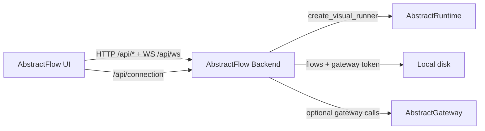

# Backlog Item 046: AbstractFlow gateway-first thin client plan

## Summary
Produce a detailed, explicit refactor plan to migrate AbstractFlow to a gateway-first thin client architecture.

## Reason
The project goal is to simplify operations and make the system more robust by centralizing execution in the gateway and running the editor via `npx` without a dedicated backend.

## Scope
### In scope
- Draft a detailed plan with explicit choices and justifications.
- Ground claims in evidence from existing code/docs.
- Include phased rollout, risks, and test plan.

### Out of scope
- Any code implementation.
- Running tests or benchmarks.

## Dependencies
- AbstractGateway API surface (runs, ledger, commands, discovery).
- AbstractFlow UI and backend contracts.
- Workflow compile/publish tooling (VisualFlow JSON format).

## Expected Outcomes
- A detailed refactor plan in `untracked/flow-refactor/`.

## Full Report
### 0) Executive intent
Refactor AbstractFlow into a gateway-first thin client where the gateway is the single execution surface and `npx @abstractframework/flow` is the only local process. The goal is to reduce operational complexity, improve reconnection robustness, and centralize durable run management without moving UI-specific logic into the gateway unless it is explicitly reusable across thin clients.

### 1) Current architecture (as-is)
Key behaviors today:
- AbstractFlow backend stores VisualFlow JSON on local disk and executes flows locally.
- UI uses HTTP `/api/*` and WebSocket `/api/ws/{flow_id}` for execution updates.
- Backend stores gateway tokens server-side and never returns them to the browser.
- Gateway is optional and used for select features (e.g. memory KG).



### 2) Target architecture (gateway-first)
Key behaviors after refactor:
- Gateway is the only execution surface (single runner loop).
- UI runs as static assets served by `npx` and proxies `/api/*` to gateway.
- UI consumes ledger replay/SSE for durable execution updates.
- Browser never sees gateway tokens; proxy injects Authorization header.

```mermaid
flowchart LR
  UI[AbstractFlow UI (static)] -->|HTTP /api/*| Proxy[npx proxy]
  Proxy -->|Authorization header| GW[AbstractGateway]
  GW -->|GatewayRunner| AR[AbstractRuntime]
  GW -->|ledger replay + SSE| UI
```

### 3) Change map (what moves where)
| Concern | Current owner | Target owner | Precise change |
|---|---|---|---|
| Flow CRUD | AbstractFlow backend (`/api/flows`) | Gateway (`/api/gateway/visualflows`) | Move VisualFlow JSON storage + metadata into gateway store |
| Flow execution | AbstractFlow backend runner | GatewayRunner | `/api/flows/{id}/run` -> `/api/gateway/runs/start` |
| Live execution updates | WebSocket `/api/ws/{flow_id}` | SSE ledger stream + UI adapter | Map ledger -> `ExecutionEvent` in the client |
| Run control | WS `control` message | `/api/gateway/commands` | Use durable commands (pause/resume/cancel) |
| Provider discovery | `/api/providers` | `/api/gateway/discovery/providers` | UI points to gateway discovery endpoints |
| Tool discovery | `/api/tools` | `/api/gateway/discovery/tools` | UI points to gateway discovery endpoints |
| Memory KG query | `/api/memory/kg/query` | `/api/gateway/kg/query` | UI uses gateway KG endpoint |
| Semantics registry | `/api/semantics` | `/api/gateway/semantics` | Gateway serves abstractsemantics registry |
| Gateway token storage | AbstractFlow backend | `npx` proxy | Proxy injects Authorization; no browser token exposure |

### 3b) Component impact (precise scope)
| Component | Change type | Precise impact |
|---|---|---|
| `abstractflow/web/backend/*` | Decommission or optional | Remove as default dependency; keep only for legacy mode |
| `abstractflow/web/frontend/*` | Update | Swap endpoints to gateway API; add SSE ledger + UI mapping |
| `abstractflow/web/frontend/bin/cli.js` | Update | Add gateway URL/token proxy injection + compatibility rewrites |
| `abstractgateway/routes/gateway.py` | Add | New CRUD/publish/semantics endpoints |
| `abstractgateway/service.py` | Update | Wire WorkflowRegistry |
| `abstractruntime/*` | No change | Remains execution/ledger core |

### 4) Boundary rules (to avoid gateway bloat)
Gateway responsibilities must be **durable, shareable, and UI-agnostic**. Anything that is:
- **Derived purely from durable run state** (ledger/run store) can live in a gateway projection layer.
- **Needed across multiple thin clients** (Flow, Observer, Assistant) is acceptable in gateway, but only through a reusable abstraction.
- **UI-specific** (layout, canvas geometry, panel state, UX-only hints) must stay in the client.

Decision rule:
- If only AbstractFlow needs it, keep it in the UI.
- If multiple thin clients need it, add a gateway abstraction with stable schemas and explicit versioning.

Observation: the gateway already includes UI-adjacent routes (e.g. triage HTML actions), so any new UI-facing behavior must be isolated in the projection layer and justified by multi-client reuse.

Gateway layering (Option A: no shared projection in this plan):
```mermaid
flowchart TB
  subgraph Core[Gateway Core (no UI logic)]
    Runner[GatewayRunner]
    Stores[Run + Ledger + Artifact Stores]
    Registry[WorkflowRegistry]
  end
  subgraph UI[Thin Clients]
    FlowUI[AbstractFlow UI]
    ObsUI[AbstractObserver UI]
  end
  Core --> UI
```

### 5) Reusable abstractions (required if we add “UI logic”)
To avoid clogging the gateway with UI-specific logic, any new gateway-side behavior must be implemented as a **reusable projection or registry**:

1) **WorkflowRegistry**
   - Owns workflow CRUD + metadata (VisualFlow JSON format).
   - Supports versioning and optimistic concurrency.
   - Can compile/publish bundles for any client, not just AbstractFlow.

2) **GatewayClientProxyAuth**
   - Proxy-side auth injection with local config.
   - Shared across `npx` UIs to avoid browser token exposure.

### 6) Transport strategy (WS -> ledger/SSE)
We intentionally drop WebSocket in favor of ledger replay + SSE:
- Ledger replay is the source of truth; SSE is a streaming optimization.
- UI must always be able to reconnect and rebuild state.
- If mapping is ambiguous, emit `#FALLBACK` with raw ledger payload.

Event mapping (precise):
- `flow_start`: first ledger record for the run id.
- `node_start`: StepRecord with node id + start timestamp.
- `node_complete`: StepRecord with finish status + outputs.
- `trace_update`: StepRecord with trace deltas (if present).
- `flow_waiting`: StepRecord indicates wait (ask_user, wait_event, subworkflow).
- `flow_paused` / `flow_resumed` / `flow_cancelled`: ledger shows command effects or run status change.
- `flow_complete` / `flow_error`: terminal status change.

### 7) Gateway API plan (detailed)
New endpoints (gateway):
- `GET /api/gateway/visualflows` (list with metadata)
- `POST /api/gateway/visualflows` (create)
- `GET /api/gateway/visualflows/{id}` (read)
- `PUT /api/gateway/visualflows/{id}` (update with etag/updated_at)
- `DELETE /api/gateway/visualflows/{id}` (delete)
- `POST /api/gateway/visualflows/{id}/publish` (compile + bundle)
- `GET /api/gateway/runs` (list + summaries)
- No gateway event projection endpoint (Option A: UI maps ledger to `ExecutionEvent`)
- `GET /api/gateway/semantics` (registry)

Existing endpoints reused:
- `/api/gateway/runs/start`
- `/api/gateway/runs/{id}/ledger`
- `/api/gateway/runs/{id}/ledger/stream`
- `/api/gateway/commands`
- `/api/gateway/discovery/providers`
- `/api/gateway/discovery/tools`
- `/api/gateway/kg/query`

Compatibility note:
- Keep a thin compatibility layer in the `npx` proxy so existing UI `/api/*` paths continue to work while the UI migrates.

### 8) Data ownership (precise)
- **Workflows (VisualFlow JSON)**: gateway-owned store (e.g. `data_dir/flows`), versioned with timestamps + etag.
- **Bundles**: gateway bundle store (existing).
- **Runs + ledger**: gateway run/ledger store (existing).
- **Artifacts**: gateway artifact store (existing).
- **Local UI state**: stays in browser (layout, viewport, panel state).

### 9) Security model (browser-safe)
Default:
- `npx` proxy injects `Authorization: Bearer <token>`.
- Browser never sees the token.
Optional hardening:
- Proxy exchanges for short-lived session tokens (scoped to read/write flows + run control).
- Explicit failure states, no silent fallbacks.

### 10) Performance + reliability constraints
- SSE connections per run can be heavy; add a multiplexed stream if needed.
- Provide batch ledger replay for multiple runs.
- Do not block gateway runner loop with projection work (projection should be side-channel, not inline with run execution).

### 11) Phased plan (timeboxed)
Phase 0 (1 week): ADR + decision gates + API contract.
Phase 1 (2-3 weeks): WorkflowRegistry + CRUD + publish endpoints.
Phase 2 (2-3 weeks): UI ledger → `ExecutionEvent` mapping + gateway mode + reconnection tests.
Phase 3 (1-2 weeks): Proxy auth injection + optional session tokens.
Phase 4 (1-2 weeks): Deprecate backend, docs + quickstart update.

### 12) Risk register (explicit)
- Event mapping gaps -> `#FALLBACK` + raw record capture.
- Auth leakage -> proxy-only injection; never store token in UI.
- Gateway overload -> projection runs out-of-band; rate limits if needed.
- UX regressions -> dual-mode UI until parity is confirmed.

### 13) Tests (required for confidence)
- Unit: CRUD, publish, event projection, run summaries.
- Integration: run lifecycle (start, wait, resume, cancel), SSE reconnect.
- Security: browser never sees auth token, no token in logs.

### 14) Evidence register
See `untracked/flow-refactor/2026-02-20_abstractflow_gateway_thin_client_plan.md` for full evidence citations, including:
- File-based flow persistence and local execution in AbstractFlow backend.
- WebSocket control channel and `ExecutionEvent` schema usage.
- Gateway ledger replay/SSE and GatewayRunner.
- Gateway VisualFlow host wiring.

### 15) Status
Planning only; no code changes or tests executed in this backlog item.
