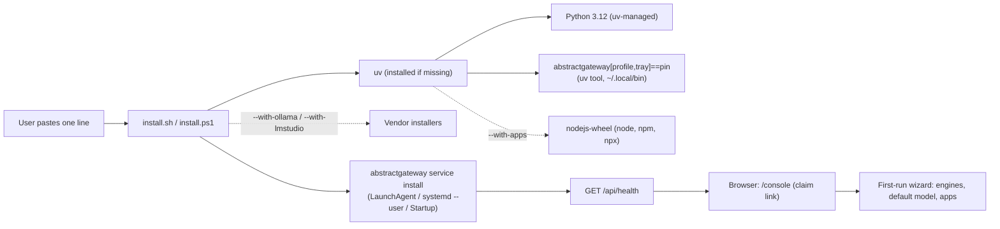

# Installer Strategy

AbstractFramework installs as a **one-line script per OS** plus the **AbstractGateway web
console** as the guided UI. The script provisions everything the gateway needs in user space,
starts it on `127.0.0.1`, and opens `/console` in the browser; from there the console configures
providers, engines, models and users. This page explains the model; [Install](../install.md) has
the commands and [ADR-0038](../adr/0038-script-bootstrap-and-gateway-console-install.md) records
the decision.

## The model in one picture

## Principles

- **No admin rights on the default path.** uv, Python, the gateway and Node all install under the
  user's home. Only optional vendor installers (Ollama on Linux, for example) may ask for sudo or
  UAC, and the script says so before running them.
- **No system Python.** uv downloads a standalone Python 3.12, which satisfies every profile (MLX,
  F5-TTS, vLLM). The script always passes `--python 3.12`.
- **One source of pins.** The gateway version comes from `bootstrap.gateway_version` in the
  generated [install manifest](release-and-manifest.md), which follows the root release pins.
- **Every step has a CLI twin.** The script prints each command; `--print` (`-Print` on Windows)
  shows the whole plan without changing anything; the final summary lists the commands so the
  install can be reproduced by hand. Power users can skip the script entirely.
- **The gateway owns the host integration.** Autostart is `abstractgateway service install`, and
  browser sign-in is a one-time claim link from `abstractgateway-config claim-url` (both in the
  pinned gateway, 0.3.0). With an older gateway selected through `--pin`, the script starts the
  gateway in the background and shows the admin token file instead.
- **Loopback first.** The gateway binds `127.0.0.1`. Remote hosts use an SSH tunnel or the
  container deployment.
- **Idempotent.** Re-running the script upgrades or repairs in place and keeps the port, profile and
  data directory from the previous run. `--uninstall` removes the service and the uv tools and keeps
  data unless `--purge` is given.

## Profiles

The script picks a profile from the machine and accepts `--profile` to override it.

| Profile | Picked when | Gateway extras | Local engines |
|---|---|---|---|
| `apple` | Apple Silicon, macOS 14 or later | `apple,tray` | MLX/Metal stacks in the gateway environment |
| `gpu` | `nvidia-smi` or `rocminfo` works (Linux; best-effort on Windows) | `gpu,tray` | CUDA/ROCm stacks |
| `light` | anything else | `tray` (Linux: only with a display) | none: remote APIs and endpoint servers (Ollama, LM Studio, vLLM, llama.cpp) |

The bootstrap installs the gateway distribution, which is the framework's deployment entry point
(ADR-0033). The full meta-package (`pip install "abstractframework[<profile>]"`) stays available
for developers who want every library in one environment.

## Where the guided UI lives

The console already covers providers, API keys, capability defaults, users and model downloads.
The first-run wizard adds: host profile, engine detection and one-click installs (with the exact
command shown), a default model filtered to what fits the machine, and app launch commands. The
terminal console (`abstractgateway-console`) offers the same screens on headless hosts.

## Large model assets

Models are not part of the bootstrap. The console's Models tab shows sizes and a fit verdict for
the machine before a download, and downloads run as background jobs with progress.

## Out of scope

Signed native launchers, enterprise MSI/pkg packages and offline bundles are not part of this
model; see [implementation-plan.md](implementation-plan.md).
